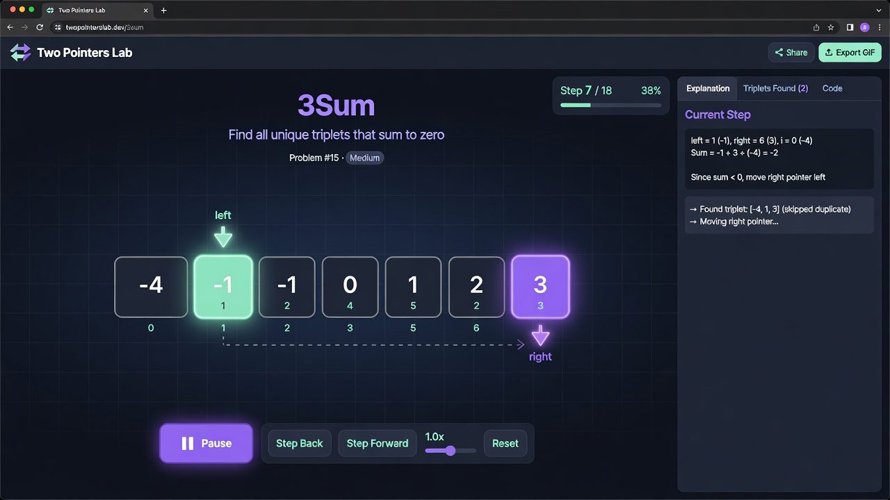

# 🎯 VisualDSAcode

<p align="center">
  <a href="Two%20Pointer%20problems/index.html">
    
  </a>
</p>

<p align="center">
  
</p>

> **Interactive visualizations for Data Structures & Algorithms** — built one beautiful problem at a time.

<p align="center">
  <a href="https://github.com/Siva010/VisualDSAcode/stargazers"></a>
  <a href="https://github.com/Siva010/VisualDSAcode/network/members"></a>
  <a href="https://github.com/Siva010/VisualDSAcode/blob/main/Two%20Pointer%20problems/index.html"></a>
  <a href="https://leetcode.com"></a>
</p>

<p align="center">
  <strong>Master the Two Pointers pattern with frame-by-frame animations.</strong><br>
  Every visualizer is carefully crafted to show exactly how the <code>left</code> and <code>right</code> pointers move.
</p>

---

## 🎬 Demo

<p align="center">
  <video src="assets/demo.mp4" autoplay loop muted playsinline style="max-width: 100%; border-radius: 12px; box-shadow: 0 10px 30px rgba(0, 0, 0, 0.4);">
    Your browser does not support the video tag. 
    
  </video>
</p>

<p align="center">
  <strong>Two pointers moving in real time</strong>
</p>

**Experience the full interactive gallery:**

👉 **[Open Two Pointers Lab →](Two%20Pointer%20problems/index.html)**

The visualizers feature:
- Real-time pointer movement animations
- Search + filter by category
- Direct LeetCode links
- Clean, modern dark theme matching this banner

---

## 📚 Available Visualizers

| #   | Problem                              | Category                    | Pattern                  | LeetCode | Visualizer |
|-----|--------------------------------------|-----------------------------|--------------------------|----------|------------|
| 1   | Two Sum                              | Foundations                 | Hash Map → Two Pointers  | [#1](https://leetcode.com/problems/two-sum/) | [Open](Two%20Pointer%20problems/two-sum-visualizer.html) |
| 167 | Two Sum II — Sorted Array            | Basic Two Pointers          | Two Pointers             | [#167](https://leetcode.com/problems/two-sum-ii-input-array-is-sorted/) | [Open](Two%20Pointer%20problems/two-sum-ii-visualizer.html) |
| 344 | Reverse String                       | Basic Two Pointers          | Two Pointers             | [#344](https://leetcode.com/problems/reverse-string/) | [Open](Two%20Pointer%20problems/reverse-string-visualizer.html) |
| 680 | Valid Palindrome II                  | Basic Two Pointers          | Two Pointers + Branch    | [#680](https://leetcode.com/problems/valid-palindrome-ii/) | [Open](Two%20Pointer%20problems/valid-palindrome-visualizer.html) |
| 141 | Linked List Cycle                    | Linked List Two Pointers    | Fast & Slow              | [#141](https://leetcode.com/problems/linked-list-cycle/) | [Open](Two%20Pointer%20problems/linked-list-cycle-visualizer.html) |
| 876 | Middle of the Linked List            | Linked List Two Pointers    | Fast & Slow              | [#876](https://leetcode.com/problems/middle-of-the-linked-list/) | [Open](Two%20Pointer%20problems/middle-of-linked-list-visualizer.html) |
| 19  | Remove Nth Node From End             | Linked List Two Pointers    | Fast & Slow + Gap        | [#19](https://leetcode.com/problems/remove-nth-node-from-end-of-list/) | [Open](Two%20Pointer%20problems/remove-nth-node-visualizer.html) |
| 15  | 3Sum                                 | Advanced Two Pointers       | Fixed + Two Pointers     | [#15](https://leetcode.com/problems/3sum/) | [Open](Two%20Pointer%20problems/3sum-visualizer.html) |
| 11  | Container With Most Water            | Advanced Two Pointers       | Two Pointers             | [#11](https://leetcode.com/problems/container-with-most-water/) | [Open](Two%20Pointer%20problems/container-with-most-water-visualizer.html) |
| 75  | Sort Colors                          | Partitioning & Window       | Dutch National Flag      | [#75](https://leetcode.com/problems/sort-colors/) | [Open](Two%20Pointer%20problems/sort-colors-visualizer.html) |
| 42  | Trapping Rain Water                  | Partitioning & Window       | Two Pointers + Running Max | [#42](https://leetcode.com/problems/trapping-rain-water/) | [Open](Two%20Pointer%20problems/trapping-rain-water-visualizer.html) |

> All visualizers are built and verified against real test cases.

---

## 🚀 Getting Started

No installation or build step required.

### Option 1 — Quick View (Recommended)
1. Clone the repo
   ```bash
   git clone https://github.com/Siva010/VisualDSAcode.git
   cd VisualDSAcode
   ```
2. Open the gallery:
   ```bash
   # On most systems this opens it in your default browser
   open "Two Pointer problems/index.html"
   ```

### Option 2 — Direct on GitHub
Navigate to any `.html` file in the browser. GitHub will render the page (best experience when cloned locally).

---

## 🧠 Why Two Pointers?

The **Two Pointers** technique is one of the most elegant patterns in algorithms:

- Reduces many **O(n²)** brute-force solutions to **O(n)**
- Works beautifully on **sorted arrays**, **linked lists**, and **strings**
- Powers solutions for famous problems like 3Sum, Trapping Rain Water, Container With Most Water, and more

Each visualizer in this repo shows the pointers moving in real time so the pattern **clicks**.

---

## 📁 Project Structure

```
VisualDSAcode/
├── Two Pointer problems/
│   ├── index.html                    # Beautiful gallery + search
│   ├── two-sum-visualizer.html
│   ├── 3sum-visualizer.html
│   ├── container-with-most-water-visualizer.html
│   └── ... (more visualizers)
├── README.md
└── (more categories coming soon)
```

---

## 🛠️ Tech Stack

- Pure **HTML + CSS + JavaScript** (no frameworks)
- Modern design with smooth animations
- Fully self-contained files — works offline

---

## 🌱 Roadmap

- [ ] More Two Pointers problems
- [ ] New categories (Sliding Window, Fast & Slow, etc.)
- [ ] Dark/light theme toggle
- [ ] Export animation as GIF
- [ ] Add Java/Python code panels alongside visuals

Have a favorite DSA problem you'd like visualized? Open an issue!

---

## 💖 Contributing

Contributions are welcome!

1. Fork the repo
2. Add a new visualizer following the existing style
3. Update `index.html` with the new problem metadata
4. Submit a PR

---

<p align="center">
  Built with ❤️ by <a href="https://github.com/Siva010">Siva010</a><br>
  <sub>One pattern at a time.</sub>
</p>
