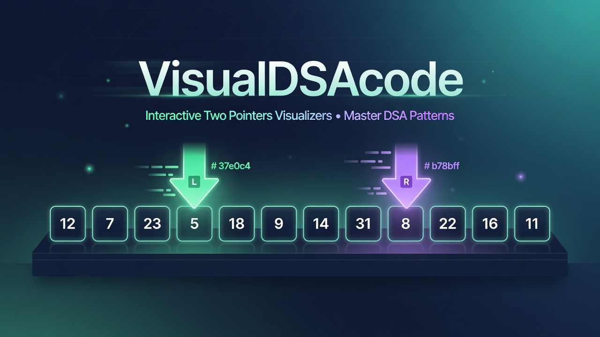
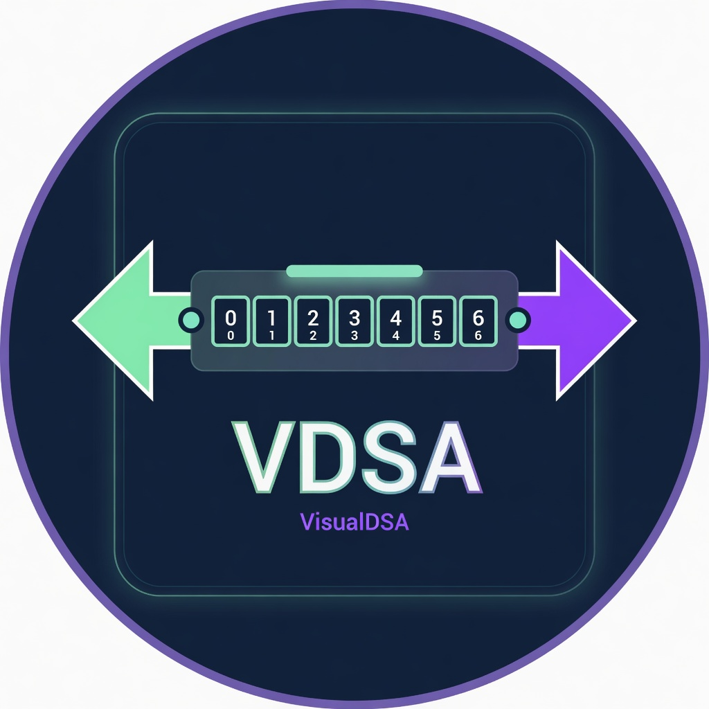

# 🎯 VisualDSAcode

<p align="center">
  <a href="index.html">
    
  </a>
</p>

<p align="center">
  
</p>

> **Interactive visualizations for Data Structures & Algorithms patterns** — step by step.

<p align="center">
  <a href="https://github.com/Siva010/VisualDSAcode/stargazers"></a>
  <a href="https://github.com/Siva010/VisualDSAcode/network/members"></a>
  <a href="index.html"></a>
  <a href="https://leetcode.com"></a>
</p>

<p align="center">
  <strong>Master DSA patterns with frame-by-frame animations.</strong><br>
  Each lab is a self-contained collection of visualizers — every solution traced against real test cases.
</p>

---

## 🎬 Interactive Labs

<p align="center">
  <strong>Two Pointers Lab</strong> — 19+ visualizers<br>
  <strong>Sliding Window Lab</strong> — expanding collection
</p>

**Experience the full interactive galleries:**

👉 **[Two Pointers Lab →](Two-Pointers_Problems/index.html)**  
👉 **[Sliding Window Lab →](Sliding-Window_Problems/index.html)**

Each lab features:
- Real-time pointer movement animations
- Search + filter by category
- Direct LeetCode links
- Clean, modern dark theme

---

## 📚 Labs & Visualizers

All visualizers are organized into focused labs (always up to date):

👉 **[Two Pointers Lab (19+ visualizers) →](Two-Pointers_Problems/index.html)**  
👉 **[Sliding Window Lab →](Sliding-Window_Problems/index.html)**

Includes problems like Two Sum, 3Sum, 4Sum, Container With Most Water, Trapping Rain Water, Valid Palindrome, and more.

> All visualizers are built and verified against real test cases.

---

## 🚀 Getting Started

No installation or build step required.

### Option 1 — Quick View (Recommended)
1. Clone the repo
   ```bash
   git clone https://github.com/Siva010/VisualDSAcode.git
   cd VisualDSAcode
   ```
2. Open the main hub:
   ```bash
   # On most systems this opens it in your default browser
   open "index.html"
   ```

   Or jump straight into a lab:
   - `Two-Pointers_Problems/index.html`
   - `Sliding-Window_Problems/index.html`

### Option 2 — Direct on GitHub
Navigate to any `.html` file or the root `index.html` in the browser. GitHub will render the pages (best experience when cloned locally).

---

## 🧠 Core Patterns

This repo focuses on powerful, interview-favorite algorithmic patterns:

### Two Pointers
The **Two Pointers** technique is one of the most elegant patterns in algorithms:
- Reduces many **O(n²)** brute-force solutions to **O(n)**
- Works beautifully on **sorted arrays**, **linked lists**, and **strings**
- Powers solutions for famous problems like 3Sum, Trapping Rain Water, Container With Most Water, and more

### Sliding Window
Maintains a dynamic window that expands and contracts while tracking invariants in a single pass.

Each visualizer shows the pointers/window moving in real time so the patterns **click**.

---

## 📁 Project Structure

```
VisualDSAcode/
├── index.html                        # Main hub — DSA Visualizer Labs
├── Two-Pointers_Problems/
│   ├── index.html                    # Two Pointers gallery + search
│   ├── two-sum-visualizer.html
│   ├── 3sum-visualizer.html
│   └── ... (19+ visualizers)
├── Sliding-Window_Problems/
│   ├── index.html
│   └── max-sum-distinct-subarrays-k-visualizer.html
├── assets/
│   ├── banner.jpg
│   └── logo.jpg
├── README.md
└── (more patterns coming soon)
```

---

## 🛠️ Tech Stack

- Pure **HTML + CSS + JavaScript** (no frameworks)
- Modern design with smooth animations
- Fully self-contained files — works offline

---

## 🌱 Roadmap

- [x] Two Pointers Lab (19+ visualizers)
- [x] Sliding Window Lab (expanding)
- [ ] More patterns (Binary Search, Fast & Slow, Backtracking, etc.)
- [ ] Dark/light theme toggle
- [ ] Export animation as GIF
- [ ] Add Java/Python code panels alongside visuals

Have a favorite DSA problem you'd like visualized? Open an issue!

---

## 💖 Contributing

Contributions are welcome!

1. Fork the repo
2. Add a new visualizer (or entire lab) following the existing style
3. Update the lab's `index.html` with the new problem metadata
4. Submit a PR

Each lab folder is self-contained.

---

<p align="center">
  Built with ❤️ by <a href="https://github.com/Siva010">Siva010</a><br>
  <sub>One pattern at a time.</sub>
</p>
